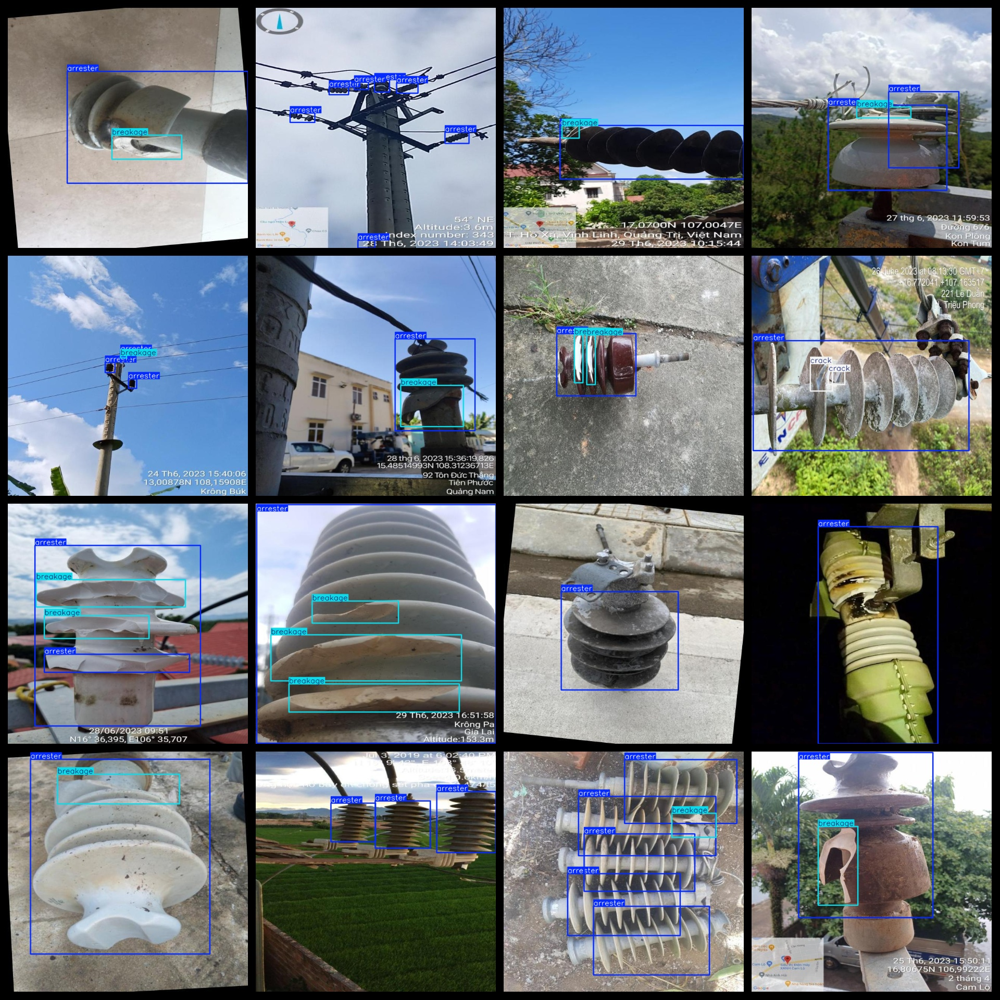

# Lightning arrestor Defect Detection Dataset 6410 imagesVOC+YOLO format

Lightning arrester defect detection dataset 6410 sheets VOC + YOLO format

Dataset format: Pascal VOC format + YOLO format (the txt file does not contain the split path, it only contains jpg images and corresponding VOC format xml files and yolo format txt files)

Image Count: 6410

Number of xml files: 6410

Number of txt files: 6410

Number of annotated categories: 3

The Github repository is: datasets_sl

["arrester", "breakage", "crack"]

Number of boxes labeled in each category:

number of arrester boxes = 10464 (lightning arrester)

number of breakage frames = 8483 (fracture)

crack frame number = 2067 (crack)

Total number of frames: 21014

Number of images per category:

"Arrester" is a term used in physics to describe the force that opposes gravity. It is not a specific type of image, but rather a concept. The number "6388" does not have a direct meaning in this context.

"Breakage of images count = 4839"

Cracking the image count = 878

Image resolution: 640x640

Use the labeling tool: labelImg

Dataset Augmentation: Yes

Rules for annotation: Draw a rectangle around the category.

Important note: The dataset does not have been divided into training, validation, and testing sets.

Special Disclaimer: This dataset does not guarantee the accuracy of the trained models or weight files.

Annotation and image details are as follows:

## Images

---

Here is a pay link on Stripe (https://buy.stripe.com/3cs8yP7sY87d0vu9AB). Please contact me lonlonago@foxmail.com after funding $89, and I will send you a complete data files, thank you!

